# 数据结构和算法-五大常用算法:回溯算法 - 秦羽的思考 - 博客园

> 原文链接：https://www.cnblogs.com/xuwc/p/13923246.html

参考：

https://www.cnblogs.com/xiaobaidashu/p/10724789.html

https://mp.weixin.qq.com/s?\_\_biz=MzU0ODMyNDk0Mw==&mid=2247488558&idx=1&sn=bb600c06c773960b3f4536c4c6c8d948&chksm=fb41870ecc360e18db1ca13783050d1a2efb19579407587baeea9b258a92e4c90c7ad12cbc1a&scene=21#wechat\_redirect

https://leetcode-cn.com/problems/permutations/solution/hui-su-suan-fa-python-dai-ma-java-dai-ma-by-liweiw/

https://leetcode-cn.com/problems/combination-sum/solution/hui-su-suan-fa-jian-zhi-python-dai-ma-java-dai-m-2/

【八皇后问题和N皇后问题-todo】https://mp.weixin.qq.com/s?\_\_biz=MzU0ODMyNDk0Mw==&mid=2247487459&idx=1&sn=f45fc8231198edb3de2acc69e17986ea&chksm=fb419cc3cc3615d5d31d55072d5c2f58e4002aa8c1b637e89f1ef577e253943c04efc39c1b1d&scene=21#wechat\_redirect

# [简单易懂回溯算法](https://www.cnblogs.com/xiaobaidashu/p/10724789.html)

**一、什么是回溯算法**

回溯算法实际上是一个类似枚举的搜索尝试过程，主要是在搜索尝试过程中寻找问题的解，当发现已不满足求解条件时，就“回溯”返回，尝试别的路径。许多复杂的，规模较大的问题都可以使用回溯法，有“通用解题方法”的美称。

回溯算法实际上是一个类似枚举的深度优先搜索尝试过程，主要是在搜索尝试过程中寻找问题的解，当发现已不满足求解条件时，就“回溯”返回（也就是递归返回），尝试别的路径。

**二、回溯算法思想**

  回溯法一般都用在要给出多个可以实现最终条件的解的最终形式。回溯法要求对解要添加一些约束条件。总的来说，如果要解决一个回溯法的问题，通常要确定三个元素：

1、选择。对于每个特定的解，肯定是由一步步构建而来的，而每一步怎么构建，肯定都是有限个选择，要怎么选择，这个要知道；同时，在编程时候要定下，优先或合法的每一步选择的顺序，一般是通过多个if或者for循环来排列。

2、条件。对于每个特定的解的某一步，他必然要符合某个解要求符合的条件，如果不符合条件，就要回溯，其实回溯也就是递归调用的返回。

3、结束。当到达一个特定结束条件时候，就认为这个一步步构建的解是符合要求的解了。把解存下来或者打印出来。对于这一步来说，有时候也可以另外写一个issolution函数来进行判断。注意，当到达第三步后，有时候还需要构建一个数据结构，把符合要求的解存起来，便于当得到所有解后，把解空间输出来。这个数据结构必须是全局的，作为参数之一传递给递归函数。

**三、递归函数的参数的选择，要遵循四个原则**

1、必须要有一个临时变量(可以就直接传递一个字面量或者常量进去)传递不完整的解，因为每一步选择后，暂时还没构成完整的解，这个时候这个选择的不完整解，也要想办法传递给递归函数。也就是，把每次递归的不同情况传递给递归调用的函数。

2、可以有一个全局变量，用来存储完整的每个解，一般是个集合容器（也不一定要有这样一个变量，因为每次符合结束条件，不完整解就是完整解了，直接打印即可）。

3、最重要的一点，一定要在参数设计中，可以得到结束条件。一个选择是可以传递一个量n，也许是数组的长度，也许是数量，等等。

4、要保证递归函数返回后，状态可以恢复到递归前，以此达到真正回溯。

## 回溯VS递归

很多人认为回溯和递归是一样的，其实不然。在回溯法中可以看到有递归的身影，但是两者是有区别的。  
  
回溯法从问题本身出发，寻找可能实现的所有情况。和穷举法的思想相近，不同在于穷举法是将所有的情况都列举出来以后再一一筛选，而回溯法在列举过程如果发现当前情况根本不可能存在，就停止后续的所有工作，返回上一步进行新的尝试。  
  
递归是从问题的结果出发，例如求 n！，要想知道 n！的结果，就需要知道 n\*(n-1)! 的结果，而要想知道 (n-1)! 结果，就需要提前知道 (n-1)\*(n-2)!。这样不断地向自己提问，不断地调用自己的思想就是递归。  
  
回溯和递归唯一的联系就是，回溯法可以用递归思想实现。

例子参考：leetcode  [22. 括号生成](https://leetcode-cn.com/problems/generate-parentheses/)

数字 n 代表生成括号的对数，请你设计一个函数，用于能够生成所有可能的并且 有效的 括号组合。

示例：

输入：n = 3  
输出：[  
 "((()))",  
 "(()())",  
 "(())()",  
 "()(())",  
 "()()()"  
 ]

来源：力扣（LeetCode）  
链接：https://leetcode-cn.com/problems/generate-parentheses  
著作权归领扣网络所有。商业转载请联系官方授权，非商业转载请注明出处。

题解：https://leetcode-cn.com/problems/generate-parentheses/solution/hui-su-suan-fa-by-liweiwei1419/

## 什么叫回溯算法，一看就会，一写就废

**什么叫回溯算法**

对于回溯算法的定义，百度百科上是这样描述的：回溯算法实际上一个类似枚举的搜索尝试过程，主要是在搜索尝试过程中寻找问题的解，当发现已不满足求解条件时，就“回溯”返回，尝试别的路径。回溯法是一种选优搜索法，按选优条件向前搜索，以达到目标。但当探索到某一步时，发现原先选择并不优或达不到目标，就退回一步重新选择，这种走不通就退回再走的技术为回溯法，而满足回溯条件的某个状态的点称为“回溯点”。许多复杂的，规模较大的问题都可以使用回溯法，有“通用解题方法”的美称。

看明白没，回溯算法其实就是一个不断探索尝试的过程，探索成功了也就成功了，探索失败了就在退一步，继续尝试……，

**组合总和**

组合总和算是一道比较经典的回溯算法题，其中有一道题是这样的。

找出所有相加之和为 n 的 k 个数的组合。组合中只允许含有 1 - 9 的正整数，并且每种组合中不存在重复的数字。

说明：

* 所有数字都是正整数。
* 解集不能包含重复的组合。

**示例 1:**

> **输入**: k = 3, n = 7
>
> **输出**: [[1,2,4]]

示例 2:

> **输入**: k = 3, n = 9
>
> **输出**: [[1,2,6], [1,3,5], [2,3,4]]

这题说的很明白，就是从1-9中选出k个数字，他们的和等于n，并且这k个数字不能有重复的。所以第一次选择的时候可以从这9个数字中任选一个，沿着这个分支走下去，第二次选择的时候还可以从这9个数字中任选一个，但因为不能有重复的，所以要排除第一次选择的，第二次选择的时候只能从剩下的8个数字中选一个……。这个选择的过程就比较明朗了，我们可以把它看做一棵9叉树，除叶子结点外每个节点都有9个子节点，也就是下面这样

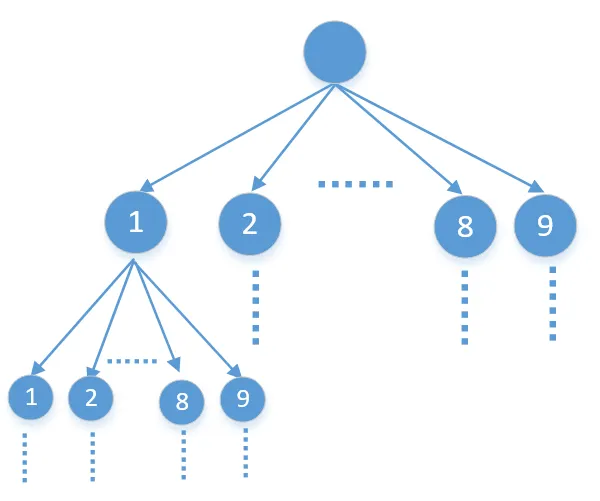

从9个数字中任选一个，就是沿着他的任一个分支一直走下去，其实就是DFS（如果不懂DFS的可以看下[373，数据结构-6,树](http://mp.weixin.qq.com/s?__biz=MzU0ODMyNDk0Mw==&mid=2247487028&idx=1&sn=e06a0cd5760e62890e60e43a279a472b&chksm=fb419d14cc36140257eb220aaeac182287b10c3cab5c803ebd54013ee3fc120d693067c2e960&scene=21#wechat_redirect)），二叉树的DFS代码是下面这样的

```
1public static void treeDFS(TreeNode root) {  
2    if (root == null)  
3        return;  
4    System.out.println(root.val);  
5    treeDFS(root.left);  
6    treeDFS(root.right);  
7}
```

这里可以仿照二叉树的DFS来写一下9叉树，9叉树的DFS就是通过递归遍历他的9个子节点，代码如下

```
 1public static void treeDFS(TreeNode root) {  
 2    //递归必须要有终止条件  
 3    if (root == null)  
 4        return;  
 5    System.out.println(root.val);  
 6  
 7    //通过循环，分别遍历9个子树  
 8    for (int i = 1; i <= 9; i++) {  
 9        //2，一些操作，可有可无，视情况而定  
10  
11        treeDFS("第i个子节点");  
12  
13        //3，一些操作，可有可无，视情况而定  
14    }  
15}
```

DFS其实就相当于遍历他的所有分支，就是列出他所有的可能结果，只要判断结果等于n就是我们要找的，那么这棵9叉树最多有多少层呢，因为有k个数字，所以最多只能有k层。来看下代码

```
 1public List<List<Integer>> combinationSum3(int k, int n) {  
 2    List<List<Integer>> res = new ArrayList<>();  
 3    dfs(res, new ArrayList<>(), k, 1, n);  
 4    return res;  
 5}  
 6  
 7private void dfs(List<List<Integer>> res, List<Integer> list, int k, int start, int n) {  
 8    //终止条件，如果满足这个条件，再往下找也没什么意义了  
 9    if (list.size() == k || n <= 0) {  
10        //如果找到一组合适的就把他加入到集合list中  
11        if (list.size() == k && n == 0)  
12            res.add(new ArrayList<>(list));  
13        return;  
14    }  
15    //通过循环，分别遍历9个子树  
16    for (int i = start; i <= 9; i++) {  
17        //选择当前值  
18        list.add(i);  
19        //递归  
20        dfs(res, list, k, i + 1, n - i);  
21        //撤销选择  
22        list.remove(list.size() - 1);  
23    }  
24}
```

代码相对来说还是比较简单的，我们来分析下（如果看懂了可以直接跳过）。

1，代码dfs中最开始的地方是终止条件的判断，之前在[426，什么是递归，通过这篇文章，让你彻底搞懂递归](http://mp.weixin.qq.com/s?__biz=MzU0ODMyNDk0Mw==&mid=2247487910&idx=1&sn=2670aec7139c6b98e83ff66114ac1cf7&chksm=fb418286cc360b90741ed54fecd62fd45571b2caba3e41473a7ea0934f918d4b31537689c664&scene=21#wechat_redirect)中讲过，递归必须要有终止条件。

2，下面的for循环分别遍历他的9个子节点，注意这里的i是从start开始的，所以有可能还没有9个子树，前面说过，如果从9个数字中选择一个之后，第2次就只能从剩下的8个选择了，第3次就只能从剩下的7个中选择了……

3，在第20行dsf中的start是i+1，这里要说一下为什么是i+1。比如我选择了3，下次就应该从4开始选择，如果不加1，下次还从3开始就出现了数字重复，明显与题中的要求不符

4，for循环的i为什么不能每次都从1开始，如果每次都从1开始就会出现结果重复，比如选择了[1，2]，下次可能就会选择[2，1]。

5，如果对回溯算法不懂的，可能最不容易理解的就是最后一行，为什么要撤销选择。如果经常看我公众号的同学可能知道，也就是我经常提到的分支污染问题，因为list是引用传递，当从一个分支跳到另一个分支的时候，如果不把前一个分支的数据给移除掉，那么list就会把前一个分支的数据带到下一个分支去，造成结果错误（下面会讲）。那么除了把前一个分支的数据给移除以外还有一种方式就是每个分支都创建一个list，这样每个分支都是一个新的list，都不互相干扰，也就是下面图中这样

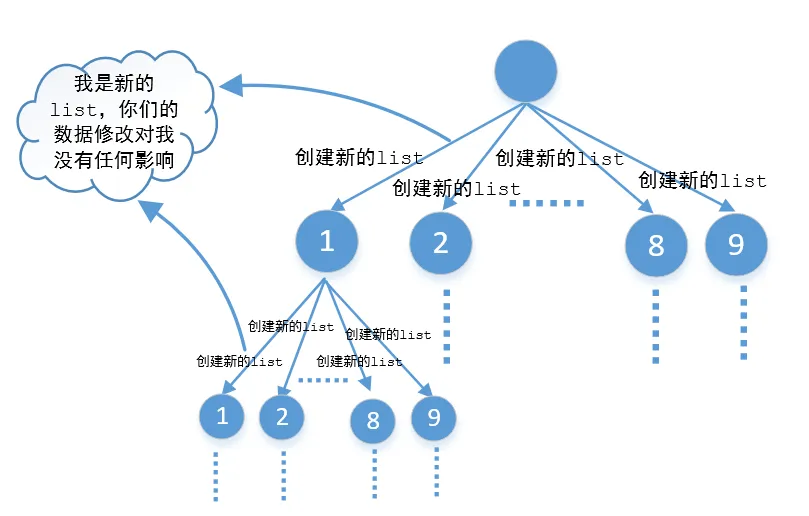

代码如下

```
 1public List<List<Integer>> combinationSum3(int k, int n) {  
 2    List<List<Integer>> res = new ArrayList<>();  
 3    dfs(res, new ArrayList<>(), k, 1, n);  
 4    return res;  
 5}  
 6  
 7private void dfs(List<List<Integer>> res, List<Integer> list, int k, int start, int n) {  
 8    //终止条件，如果满足这个条件，再往下找也没什么意义了  
 9    if (list.size() == k || n <= 0) {  
10        //如果找到一组合适的就把他加入到集合list中  
11        if (list.size() == k && n == 0)  
12            res.add(new ArrayList<>(list));  
13        return;  
14    }  
15    //通过循环，分别遍历9个子树  
16    for (int i = start; i <= 9; i++) {  
17        //创建一个新的list，和原来的list撇清关系，对当前list的修改并不会影响到之前的list  
18        List<Integer> subList = new LinkedList<>(list);  
19        subList.add(i);  
20        //递归  
21        dfs(res, subList, k, i + 1, n - i);  
22        //注意这里没有撤销的操作，因为是在一个新的list中的修改，原来的list并没有修改，  
23        //所以不需要撤销操作  
24    }  
25}
```

我们看到最后并没有撤销的操作，这是因为每个分支都是一个新的list，你对当前分支的修改并不会影响到其他分支，所以并不需要撤销操作。

注意：大家尽量不要写这样的代码，这种方式虽然也能解决，但每个分支都会重新创建list，效率很差。

要搞懂最后一行代码首先要明白什么是递归，递归分为递和归两部分，递就是往下传递，归就是往回走。递归你从什么地方调用最终还会回到什么地方去，我们来画个简单的图看一下

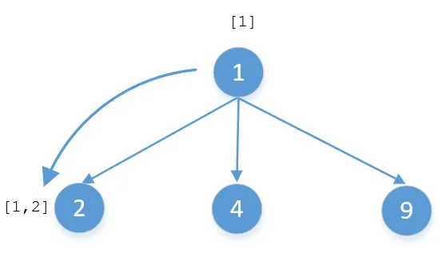

这是一棵非常简单的3叉树，假如要对他进行DFS遍历，当沿着1→2这条路径走下去的时候，list中应该是[1，2]。因为是递归调用最终还会回到节点1，如果不把2给移除掉，当沿着1→4这个分支走下去的时候就变成[1，2，4]，但实际上1→4这个分支的结果应该是[1，4]，这是因为我们把前一个分支的值给带过来了。当1，2这两个节点遍历完之后最终还是返回节点1，在回到节点1的时候就应该把结点2的值给移除掉，让list变为[1]，然后再沿着1→4这个分支走下去，结果就是[1，4]。

我们来总结一下回溯算法的代码模板吧

```
 1private void backtrack("原始参数") {  
 2    //终止条件(递归必须要有终止条件)  
 3    if ("终止条件") {  
 4        //一些逻辑操作（可有可无，视情况而定）  
 5        return;  
 6    }  
 7  
 8    for (int i = "for循环开始的参数"; i < "for循环结束的参数"; i++) {  
 9        //一些逻辑操作（可有可无，视情况而定）  
10  
11        //做出选择  
12  
13        //递归  
14        backtrack("新的参数");  
15        //一些逻辑操作（可有可无，视情况而定）  
16  
17        //撤销选择  
18    }  
19}
```

有了模板，回溯算法的代码就非常容易写了，下面就根据模板来写几个经典回溯案例的答案。

**八皇后问题**

八皇后问题也是一道非常经典的回溯算法题，前面也有对八皇后问题的专门介绍，有不明白的可以先看下[394，经典的八皇后问题和N皇后问题](http://mp.weixin.qq.com/s?__biz=MzU0ODMyNDk0Mw==&mid=2247487459&idx=1&sn=f45fc8231198edb3de2acc69e17986ea&chksm=fb419cc3cc3615d5d31d55072d5c2f58e4002aa8c1b637e89f1ef577e253943c04efc39c1b1d&scene=21#wechat_redirect)。他就是不断的尝试，如果当前位置能放皇后就放，一直到最后一行如果也能放就表示成功了，如果某一个位置不能放，就回到上一步重新尝试。比如我们先在第1行第1列放一个皇后，如下图所示

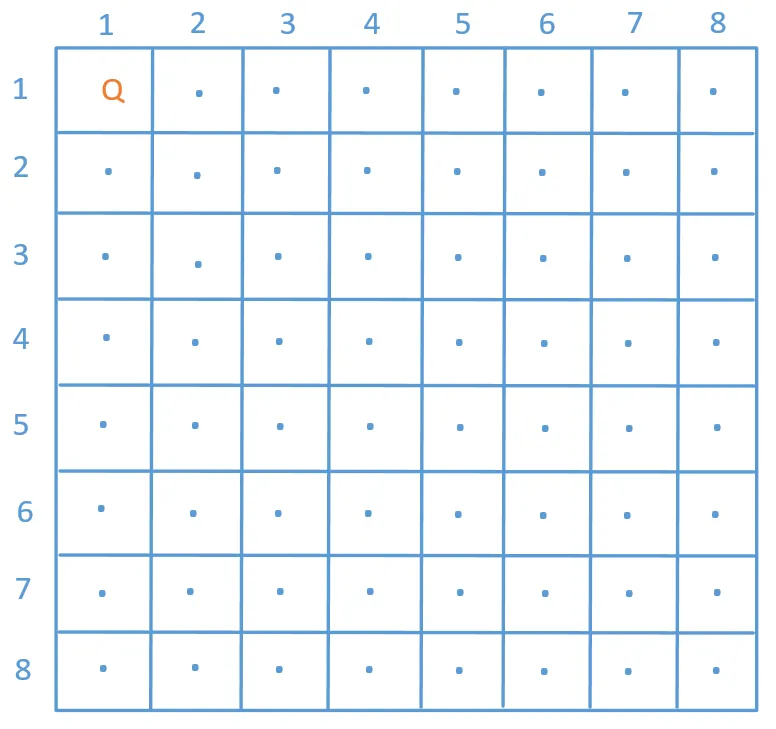

然后第2行从第1列开始在不冲突的位置再放一个皇后，然后第3行……一直这样放下去，如果能放到第8行还不冲突说明成功了，如果没到第8行的时候出现了冲突就回到上一步继续查找合适的位置……来看下代码

```
 1//row表示的是第几行  
 2public void solve(char[][] chess, int row) {  
 3    //终止条件，row是从0开始的，最后一行都可以放，说明成功了  
 4    if (row == chess.length) {  
 5        //自己写的一个公共方法，打印二维数组的，  
 6        //主要用于测试数据用的  
 7        Util.printTwoCharArrays(chess);  
 8        System.out.println();  
 9        return;  
10    }  
11    for (int col = 0; col < chess.length; col++) {  
12        //验证当前位置是否可以放皇后  
13        if (valid(chess, row, col)) {  
14            //如果在当前位置放一个皇后不冲突，  
15            //就在当前位置放一个皇后  
16            chess[row][col] = 'Q';  
17            //递归，在下一行继续……  
18            solve(chess, row + 1);  
19            //撤销当前位置的皇后  
20            chess[row][col] = '.';  
21        }  
22    }  
23}
```

**全排列问题**

给定一个没有重复数字的序列，返回其所有可能的全排列。

示例:

> **输入**: [1,2,3]
>
> **输出**:
>
> [
>
>   [1,2,3],
>
>   [1,3,2],
>
>   [2,1,3],
>
>   [2,3,1],
>
>   [3,1,2],
>
>   [3,2,1]
>
> ]

这道题我们可以把它当做一棵3叉树，所以每一步都会有3种选择，具体过程就不在分析了，直接根据上面的模板来写下代码

```
 1public List<List<Integer>> permute(int[] nums) {  
 2    List<List<Integer>> list = new ArrayList<>();  
 3    backtrack(list, new ArrayList<>(), nums);  
 4    return list;  
 5}  
 6  
 7private void backtrack(List<List<Integer>> list, List<Integer> tempList, int[] nums) {  
 8    //终止条件  
 9    if (tempList.size() == nums.length) {  
10        //说明找到一一组组合  
11        list.add(new ArrayList<>(tempList));  
12        return;  
13    }  
14    for (int i = 0; i < nums.length; i++) {  
15        //因为不能有重复的，所以有重复的就不能选  
16        if (tempList.contains(nums[i]))  
17            continue;  
18        //选择当前值  
19        tempList.add(nums[i]);  
20        //递归  
21        backtrack(list, tempList, nums);  
22        //撤销选择  
23        tempList.remove(tempList.size() - 1);  
24    }  
25}
```

是不是感觉很简单。

**子集问题**

给定一组不含重复元素的整数数组 nums，返回该数组所有可能的子集（幂集）。

说明：解集不能包含重复的子集。

示例:

> **输入**: nums = [1,2,3]
>
> **输出**:
>
> [
>
>   [3],
>
>   [1],
>
>   [2],
>
>   [1,2,3],
>
>   [1,3],
>
>   [2,3],
>
>   [1,2],
>
>   []
>
> ]

我们还是根据模板来修改吧

```
 1public List<List<Integer>> subsets(int[] nums) {  
 2    List<List<Integer>> list = new ArrayList<>();  
 3    //先排序  
 4    Arrays.sort(nums);  
 5    backtrack(list, new ArrayList<>(), nums, 0);  
 6    return list;  
 7}  
 8  
 9private void backtrack(List<List<Integer>> list, List<Integer> tempList, int[] nums, int start) {  
10    //注意这里没有写终止条件，不是说递归一定要有终止条件的吗，这里怎么没写，其实这里的终止条件  
11    //隐含在for循环中了，当然我们也可以写if(start>nums.length) rerurn;只不过这里省略了。  
12    list.add(new ArrayList<>(tempList));  
13    for (int i = start; i < nums.length; i++) {  
14        //做出选择  
15        tempList.add(nums[i]);  
16        //递归  
17        backtrack(list, tempList, nums, i + 1);  
18        //撤销选择  
19        tempList.remove(tempList.size() - 1);  
20    }  
21}
```

所以类似这种题基本上也就是这个套路，就是先做出选择，然后递归，最后再撤销选择。在讲第一道示例的时候提到过撤销的原因是防止把前一个分支的结果带到下一个分支造成结果错误。不过他们不同的是，一个是终止条件的判断，还一个就是for循环的起始值，这些都要具体问题具体分析。下面再来看最后一到题解数独。

**解数独**

数独大家都玩过吧，他的规则是这样的

一个数独的解法需遵循如下规则：

* 数字 1-9 在每一行只能出现一次。
* 数字 1-9 在每一列只能出现一次。
* 数字 1-9 在每一个以粗实线分隔的 3x3 宫内只能出现一次。

过程就不在分析了，直接看代码，代码中也有详细的注释，这篇讲的是回溯算法，这里主要看一下backTrace方法即可，其他的可以先不用看

```
 1//回溯算法  
 2public static boolean solveSudoku(char[][] board) {  
 3    return backTrace(board, 0, 0);  
 4}  
 5  
 6//注意这里的参数，row表示第几行，col表示第几列。  
 7private static boolean backTrace(char[][] board, int row, int col) {  
 8    //注意row是从0开始的，当row等于board.length的时候表示数独的  
 9    //最后一行全部读遍历完了，说明数独中的值是有效的，直接返回true  
10    if (row == board.length)  
11        return true;  
12    //如果当前行的最后一列也遍历完了，就从下一行的第一列开始。这里的遍历  
13    //顺序是从第1行的第1列一直到最后一列，然后第二行的第一列一直到最后  
14    //一列，然后第三行的……  
15    if (col == board.length)  
16        return backTrace(board, row + 1, 0);  
17    //如果当前位置已经有数字了，就不能再填了，直接到这一行的下一列  
18    if (board[row][col] != '.')  
19        return backTrace(board, row, col + 1);  
20    //如果上面条件都不满足，我们就从1到9中选择一个合适的数字填入到数独中  
21    for (char i = '1'; i <= '9'; i++) {  
22        //判断当前位置[row，col]是否可以放数字i，如果不能放再判断下  
23        //一个能不能放，直到找到能放的为止，如果从1-9都不能放，就会下面  
24        //直接return false  
25        if (!isValid(board, row, col, i))  
26            continue;  
27        //如果能放数字i，就把数字i放进去  
28        board[row][col] = i;  
29        //如果成功就直接返回，不需要再尝试了  
30        if (backTrace(board, row, col))  
31            return true;  
32        //否则就撤销重新选择  
33        board[row][col] = '.';  
34    }  
35    //如果当前位置[row，col]不能放任何数字，直接返回false  
36    return false;  
37}  
38  
39//验证当前位置[row，col]是否可以存放字符c  
40private static boolean isValid(char[][] board, int row, int col, char c) {  
41    for (int i = 0; i < 9; i++) {  
42        if (board[i][col] != '.' && board[i][col] == c)  
43            return false;  
44        if (board[row][i] != '.' && board[row][i] == c)  
45            return false;  
46        if (board[3 * (row / 3) + i / 3][3 * (col / 3) + i % 3] != '.' &&  
47                board[3 * (row / 3) + i / 3][3 * (col / 3) + i % 3] == c)  
48            return false;  
49    }  
50    return true;  
51}
```

**总结**

回溯算法要和递归结合起来就很好理解了，递归分为两部分，第一部分是先往下传递，第二部分到达终止条件的时候然后再反弹往回走，我们来看一下阶乘的递归

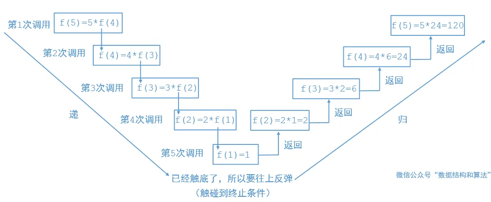

其实回溯算法就是在往下传递的时候把某个值给改变，然后往回反弹的时候再把原来的值复原即可。比如八皇后的时候我们先假设一个位置可以放皇后，如果走不通就把当前位置给撤销，放其他的位置。如果是组合之类的问题，往下传递的时候我们把当前值加入到list中，然后往回反弹的时候在把它从list中给移除掉即可。

关于回溯算法前面也讲过一些，有兴趣的可以看下

[446，回溯算法解黄金矿工问题](http://mp.weixin.qq.com/s?__biz=MzU0ODMyNDk0Mw==&mid=2247488484&idx=1&sn=924f9749342d559cb235488e5bc53296&chksm=fb4180c4cc3609d277c3dead24dd979e64962c9ca9820159332c52e022bbf6587d3d4420b732&scene=21#wechat_redirect)

[442，回溯算法解二叉树中和为某一值的路径](http://mp.weixin.qq.com/s?__biz=MzU0ODMyNDk0Mw==&mid=2247488384&idx=1&sn=a493184aa793fee33d756b22cf873dc7&chksm=fb4180a0cc3609b63c48bafcc89a73d087e5827ec6acc982d9cb69d9702221119c2b990ddb22&scene=21#wechat_redirect)

[420，回溯算法解矩阵中的路径](http://mp.weixin.qq.com/s?__biz=MzU0ODMyNDk0Mw==&mid=2247487803&idx=1&sn=26c7e7077cb9e7d2ae6e7988fcb1d5e4&chksm=fb41821bcc360b0d57f39e79243a8be7f2ec0abc653bc82b05c7938cc948cee1342a59dc35e4&scene=21#wechat_redirect)

[391，回溯算法求组合问题](http://mp.weixin.qq.com/s?__biz=MzU0ODMyNDk0Mw==&mid=2247487390&idx=1&sn=b7467c6109e9619e65ca5b2241a94406&chksm=fb419cbecc3615a82c2fc018918ddc748efcb19b13d7d898a42a17ae1faf05302f49b4c21e00&scene=21#wechat_redirect)

#### [leetcode 46. 全排列](https://leetcode-cn.com/problems/permutations/)

给定一个 没有重复 数字的序列，返回其所有可能的全排列。

示例:

输入: [1,2,3]  
输出:  
[  
 [1,2,3],  
 [1,3,2],  
 [2,1,3],  
 [2,3,1],  
 [3,1,2],  
 [3,2,1]  
]

来源：力扣（LeetCode）  
链接：https://leetcode-cn.com/problems/permutations  
著作权归领扣网络所有。商业转载请联系官方授权，非商业转载请注明出处。

题解：

回溯算法与深度优先遍历  
以下是维基百科中「回溯算法」和「深度优先遍历」的定义。

回溯法 采用试错的思想，它尝试分步的去解决一个问题。在分步解决问题的过程中，当它通过尝试发现现有的分步答案不能得到有效的正确的解答的时候，它将取消上一步甚至是上几步的计算，再通过其它的可能的分步解答再次尝试寻找问题的答案。回溯法通常用最简单的递归方法来实现，在反复重复上述的步骤后可能出现两种情况：

找到一个可能存在的正确的答案；  
在尝试了所有可能的分步方法后宣告该问题没有答案。  
深度优先搜索 算法（英语：Depth-First-Search，DFS）是一种用于遍历或搜索树或图的算法。这个算法会 尽可能深 的搜索树的分支。当结点 v 的所在边都己被探寻过，搜索将 回溯 到发现结点 v 的那条边的起始结点。这一过程一直进行到已发现从源结点可达的所有结点为止。如果还存在未被发现的结点，则选择其中一个作为源结点并重复以上过程，整个进程反复进行直到所有结点都被访问为止。

我刚开始学习「回溯算法」的时候觉得很抽象，一直不能理解为什么递归之后需要做和递归之前相同的逆向操作，在做了很多相关的问题以后，我发现其实「回溯算法」与「 深度优先遍历 」有着千丝万缕的联系。

个人理解  
「回溯算法」与「深度优先遍历」都有「不撞南墙不回头」的意思。我个人的理解是：「回溯算法」强调了「深度优先遍历」思想的用途，用一个 不断变化 的变量，在尝试各种可能的过程中，搜索需要的结果。强调了 回退 操作对于搜索的合理性。而「深度优先遍历」强调一种遍历的思想，与之对应的遍历思想是「广度优先遍历」。至于广度优先遍历为什么没有成为强大的搜索算法，我们在题解后面会提。

在「力扣」第 51 题的题解《回溯算法（第 46 题 + 剪枝）》 中，展示了如何使用回溯算法搜索 44 皇后问题的一个解，相信对大家直观地理解「回溯算法」是有帮助。

搜索与遍历  
我们每天使用的搜索引擎帮助我们在庞大的互联网上搜索信息。搜索引擎的「搜索」和「回溯搜索」算法里「搜索」的意思是一样的。

搜索问题的解，可以通过 遍历 实现。所以很多教程把「回溯算法」称为爆搜（暴力解法）。因此回溯算法用于 搜索一个问题的所有的解 ，通过深度优先遍历的思想实现。

与动态规划的区别  
共同点  
用于求解多阶段决策问题。多阶段决策问题即：

求解一个问题分为很多步骤（阶段）；  
每一个步骤（阶段）可以有多种选择。  
不同点  
动态规划只需要求我们评估最优解是多少，最优解对应的具体解是什么并不要求。因此很适合应用于评估一个方案的效果；  
回溯算法可以搜索得到所有的方案（当然包括最优解），但是本质上它是一种遍历算法，时间复杂度很高。

作者：liweiwei1419  
链接：https://leetcode-cn.com/problems/permutations/solution/hui-su-suan-fa-python-dai-ma-java-dai-ma-by-liweiw/  
来源：力扣（LeetCode）  
著作权归作者所有。商业转载请联系作者获得授权，非商业转载请注明出处。

#### [leetcode 39. 组合总和](https://leetcode-cn.com/problems/combination-sum/)

给定一个无重复元素的数组 candidates 和一个目标数 target ，找出 candidates 中所有可以使数字和为 target 的组合。

candidates 中的数字可以无限制重复被选取。

说明：

所有数字（包括 target）都是正整数。  
解集不能包含重复的组合。   
示例 1：

输入：candidates = [2,3,6,7], target = 7,  
所求解集为：  
[  
 [7],  
 [2,2,3]  
]  
示例 2：

输入：candidates = [2,3,5], target = 8,  
所求解集为：  
[  
  [2,2,2,2],  
  [2,3,3],  
  [3,5]  
]

提示：

1 <= candidates.length <= 30  
1 <= candidates[i] <= 200  
candidate 中的每个元素都是独一无二的。  
1 <= target <= 500

来源：力扣（LeetCode）  
链接：https://leetcode-cn.com/problems/combination-sum  
著作权归领扣网络所有。商业转载请联系官方授权，非商业转载请注明出处。

题解：

https://leetcode-cn.com/problems/combination-sum/solution/hui-su-suan-fa-jian-zhi-python-dai-ma-java-dai-m-2/

## 经典的八皇后问题和N皇后问题

**八皇后的来源**

**八皇后问题**是一个以国际象棋为背景的问题：如何能够在8×8的国际象棋棋盘上放置八个皇后，使得任何一个皇后都无法直接吃掉其他的皇后？为了达到此目的，任两个皇后都不能处于同一条横行、纵行或斜线上。八皇后问题可以推广为更一般的n皇后摆放问题：这时棋盘的大小变为n×n，而皇后个数也变成n。当且仅当n = 1或n ≥ 4时问题有解。

八皇后问题最早是由国际象棋棋手马克斯·贝瑟尔（Max Bezzel）于1848年提出。第一个解在1850年由弗朗兹·诺克（Franz Nauck）给出。并且将其推广为更一般的n皇后摆放问题。诺克也是首先将问题推广到更一般的n皇后摆放问题的人之一。

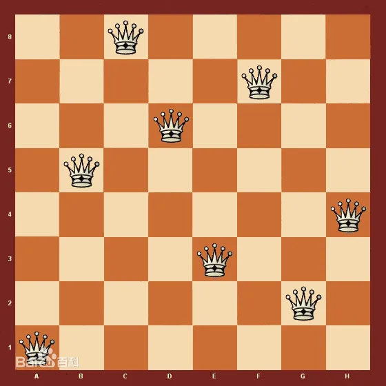

**问题分析**

我们先不看8皇后，我们先来看一下4皇后，其实原理都是一样的，比如在下面的4\*4的格子里，如果我们在其中一个格子里输入了皇后，那么在这一行这一列和这左右两边的对角线上都不能有皇后。

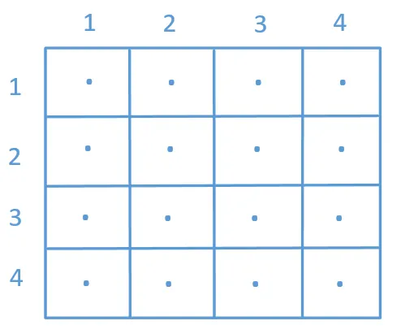

所以有一种方式就是我们一个个去试

**第一行**

比如我们在第一行第一列输入了一个皇后

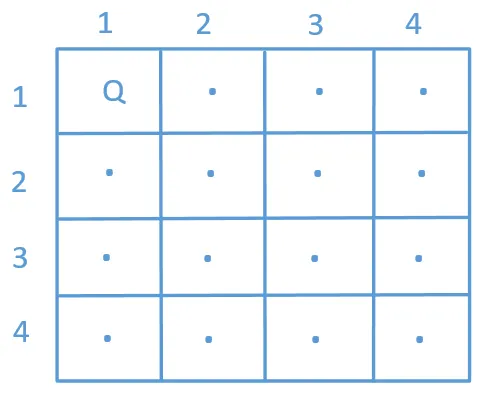

**第二行**

第二行我们就不能在第一列和第二列输入皇后了，因为有冲突了。但我们可以在第3列输入皇后

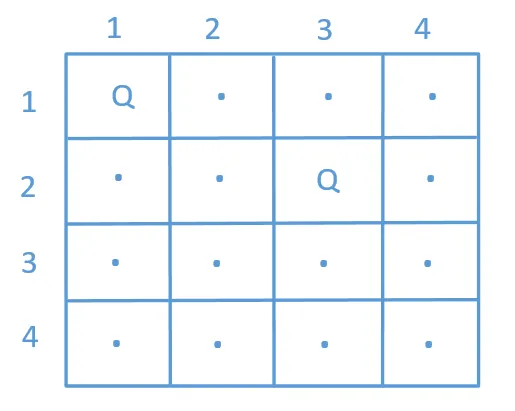

**第三行**

第三行我们发现在任何位置输入都会有冲突。这说明我们之前选择的是错误的，再回到上一步，我们发现第二步不光能选择第3列，而且还能选择第4列，既然选择第3列不合适，那我们就选择第4列吧

**第二行（重新选择）**

第二行我们选择第4列

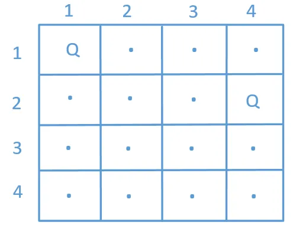

**第三行**（重新选择）

第3行我们只有选择第2列不会有冲突

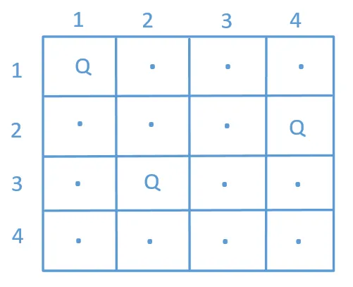

**第四行**

我们发现第4行又没有可选择的了。第一次重试失败

**第二次重试**

到这里我们只有重新回到第一步了，这说明我们之前第一行选择第一列是无解的，所以我们第一行不应该选择第一列，我们再来选择第二列来试试

**第一行**

这一行我们选择第2列

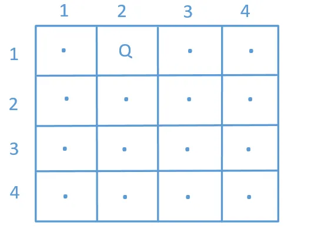

**第二行**

第二行我们前3个都不能选，只能选第4列

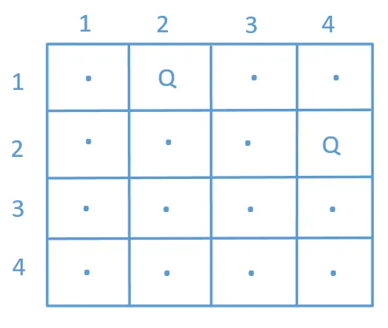

**第三行**

第三行我们只能选第1列

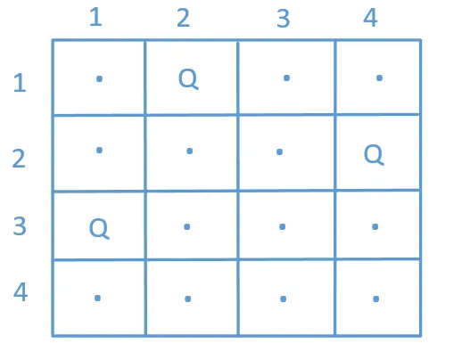

**第四行**

第四行我们只能选第3列

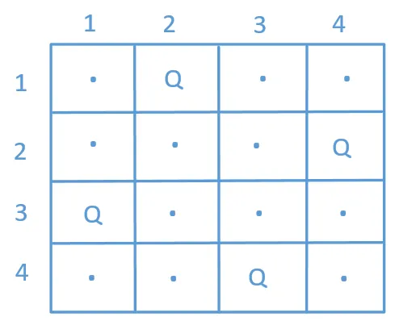

最后我们终于找到了一组解。除了这组解还有没有其他解呢，肯定还是有的，因为4皇后是有两组解的，这里我们就不在一个个试了。

我们来看一下他查找的过程，就是先从第1行的第1列开始往下找，然后再从第1行的第2列……，一直到第1行的第n列。代码该怎么写呢，看到这里估计大家都已经想到了，这不就是一棵N叉树的前序遍历吗，我们来看下，是不是下面这样的。

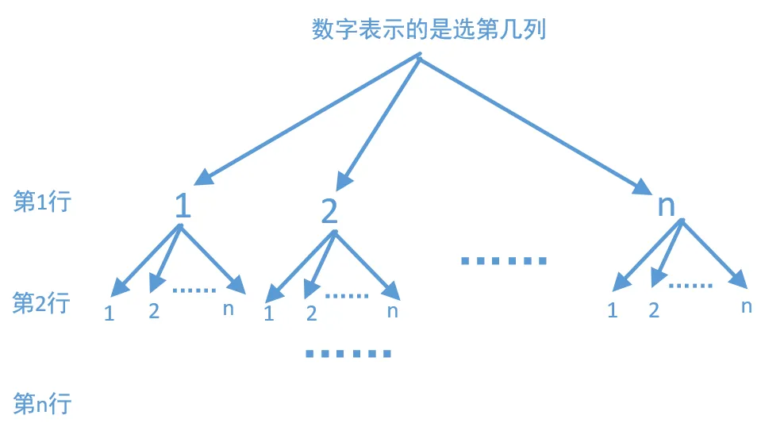

我们先来看一下二叉树的前序遍历怎么写，不明白的可以参考下[373，数据结构-6,树](http://mp.weixin.qq.com/s?__biz=MzU0ODMyNDk0Mw==&mid=2247487028&idx=1&sn=e06a0cd5760e62890e60e43a279a472b&chksm=fb419d14cc36140257eb220aaeac182287b10c3cab5c803ebd54013ee3fc120d693067c2e960&scene=21#wechat_redirect)

```
public static void preOrder(TreeNode tree) {    if (tree == null)        return;    System.out.printf(tree.val + "");    preOrder(tree.left);    preOrder(tree.right);}
```

二叉树是有两个子节点，那么N叉树当然是有N个子节点了，所以N叉树的前序遍历是这样的

```
public static void preOrder(TreeNode tree) {    if (tree == null)        return;    System.out.printf(tree.val + "");    preOrder("第1个子节点");    preOrder("第2个子节点");    ……    preOrder("第n个子节点");}
```

如果N是一个很大的值，这样写要写死人了，我们一般使用循环的方式

```
public static void preOrder(TreeNode tree) {    if (tree == null)        return;    System.out.printf(tree.val + "");    for (int i = 0; i <n ; i++) {        preOrder("第i个子节点");    }}
```

搞懂了上面的分析过程，那么这题的代码轮廓就呼之欲出了

```
 1private void solve(char[][] chess, int row) {  
 2    "终止条件"  
 3    return;  
 4  
 5    for (int col = 0; col < chess.length; col++) {  
 6        //判断这个位置是否可以放皇后  
 7        if (valid(chess, row, col)) {  
 8            //如果可以放，我们就把原来的数组chess复制一份，  
 9            char[][] temp = copy(chess);  
10            //然后在这个位置放上皇后  
11            temp[row][col] = 'Q';  
12            //下一行  
13            solve(temp, row + 1);  
14        }  
15    }  
16}
```

我们来分析下上面的代码，因为是递归所以必须要有终止条件，那么这题的终止条件就是我们最后一行已经走完了，也就是

```
if (row == chess.length) {         return;}
```

第7行就是判断在这个位置我们能不能放皇后，如果不能放我们就判断这一行的下一列能不能放……，如果能放我们就把原来数组chess复制一份，然后把皇后放到这个位置，然后再判断下一行，这和我们上面画图的过程非常类似。注意这里的第9行为什么要复制一份，因为数组是引用传递，这涉及到递归的时候分支污染问题（后面有时间我会专门写一篇关于递归的时候分支污染问题）。当然不复制一份也是可以的，我们下面再讲。当我们把上面的问题都搞懂的时候，代码也就很容易写出来了，我们来看下N皇后的最终代码

```
 1public void solveNQueens(int n) {  
 2    char[][] chess = new char[n][n];  
 3    for (int i = 0; i < n; i++)  
 4        for (int j = 0; j < n; j++)  
 5            chess[i][j] = '.';  
 6    solve(chess, 0);  
 7}  
 8  
 9private void solve(char[][] chess, int row) {  
10    if (row == chess.length) {  
11        //自己写的一个公共方法，打印二维数组的，  
12        // 主要用于测试数据用的  
13        Util.printTwoCharArrays(chess);  
14        System.out.println();  
15        return;  
16    }  
17    for (int col = 0; col < chess.length; col++) {  
18        if (valid(chess, row, col)) {  
19            char[][] temp = copy(chess);  
20            temp[row][col] = 'Q';  
21            solve(temp, row + 1);  
22        }  
23    }  
24}  
25  
26//把二维数组chess中的数据测下copy一份  
27private char[][] copy(char[][] chess) {  
28    char[][] temp = new char[chess.length][chess[0].length];  
29    for (int i = 0; i < chess.length; i++) {  
30        for (int j = 0; j < chess[0].length; j++) {  
31            temp[i][j] = chess[i][j];  
32        }  
33    }  
34    return temp;  
35}  
36  
37//row表示第几行，col表示第几列  
38private boolean valid(char[][] chess, int row, int col) {  
39    //判断当前列有没有皇后,因为他是一行一行往下走的，  
40    //我们只需要检查走过的行数即可，通俗一点就是判断当前  
41    //坐标位置的上面有没有皇后  
42    for (int i = 0; i < row; i++) {  
43        if (chess[i][col] == 'Q') {  
44            return false;  
45        }  
46    }  
47    //判断当前坐标的右上角有没有皇后  
48    for (int i = row - 1, j = col + 1; i >= 0 && j < chess.length; i--, j++) {  
49        if (chess[i][j] == 'Q') {  
50            return false;  
51        }  
52    }  
53    //判断当前坐标的左上角有没有皇后  
54    for (int i = row - 1, j = col - 1; i >= 0 && j >= 0; i--, j--) {  
55        if (chess[i][j] == 'Q') {  
56            return false;  
57        }  
58    }  
59    return true;  
60}
```

代码看起来比较多，我们主要看下solve方法即可，其他的方法不看也可以，知道有这个功能就行。solve代码中其核心代码是在17-23行，上面是终止条件的判断，我们就用4皇后来测试一下

```
solveNQueens(4);
```

看一下打印的结果

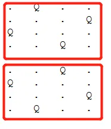

我们看到4皇后的时候有两组解，其中第一组和我们上面图中分析的完全一样。

4皇后解决了，那么8皇后也一样，我们只要在函数调用的时候传入8就可以了。同理，要想计算10皇后，20皇后，100皇后……也都是可以的。

**回溯解决**

上面代码中每次遇到能放皇后的时候，我们都会把原数组复制一份，这样对新数据的修改就不会影响到原来的，也就是不会造成分支污染。但这样每次尝试的时候都都把原数组复制一份，影响效率，有没有其他的方法不复制呢，是有的。就是每次我们选择把这个位置放置皇后的时候，如果最终不能成功，那么返回的时候我们就还要把这个位置还原。这就是回溯算法，也是试探算法。我们来看下代码

```
 1private void solve(char[][] chess, int row) {  
 2    if (row == chess.length) {  
 3        //自己写的一个公共方法，打印二维数组的，  
 4        // 主要用于测试数据用的  
 5        Util.printTwoCharArrays(chess);  
 6        System.out.println();  
 7        return;  
 8    }  
 9    for (int col = 0; col < chess.length; col++) {  
10        if (valid(chess, row, col)) {  
11            chess[row][col] = 'Q';  
12            solve(chess, row + 1);  
13            chess[row][col] = '.';  
14        }  
15    }  
16}
```

主要来看下11-13行，其他的都没变，还和上面的一样。这和我们之前讲的[391，回溯算法求组合问题](http://mp.weixin.qq.com/s?__biz=MzU0ODMyNDk0Mw==&mid=2247487390&idx=1&sn=b7467c6109e9619e65ca5b2241a94406&chksm=fb419cbecc3615a82c2fc018918ddc748efcb19b13d7d898a42a17ae1faf05302f49b4c21e00&scene=21#wechat_redirect)很类似。他是先假设[row][col]这个位置可以放皇后，然后往下找，无论找到找不到最后都会回到这个地方，因为这里是递归调用，回到这个地方的时候我们再把它复原，然后走下一个分支。最后我们再来看下使用回溯算法解N皇后的完整代码

```
 1public void solveNQueens(int n) {  
 2    char[][] chess = new char[n][n];  
 3    for (int i = 0; i < n; i++)  
 4        for (int j = 0; j < n; j++)  
 5            chess[i][j] = '.';  
 6    solve(chess, 0);  
 7}  
 8  
 9private void solve(char[][] chess, int row) {  
10    if (row == chess.length) {  
11        //自己写的一个公共方法，打印二维数组的，  
12        // 主要用于测试数据用的  
13        Util.printTwoCharArrays(chess);  
14        System.out.println();  
15        return;  
16    }  
17    for (int col = 0; col < chess.length; col++) {  
18        if (valid(chess, row, col)) {  
19            chess[row][col] = 'Q';  
20            solve(chess, row + 1);  
21            chess[row][col] = '.';  
22        }  
23    }  
24}  
25  
26//row表示第几行，col表示第几列  
27private boolean valid(char[][] chess, int row, int col) {  
28    //判断当前列有没有皇后,因为他是一行一行往下走的，  
29    //我们只需要检查走过的行数即可，通俗一点就是判断当前  
30    //坐标位置的上面有没有皇后  
31    for (int i = 0; i < row; i++) {  
32        if (chess[i][col] == 'Q') {  
33            return false;  
34        }  
35    }  
36    //判断当前坐标的右上角有没有皇后  
37    for (int i = row - 1, j = col + 1; i >= 0 && j < chess.length; i--, j++) {  
38        if (chess[i][j] == 'Q') {  
39            return false;  
40        }  
41    }  
42    //判断当前坐标的左上角有没有皇后  
43    for (int i = row - 1, j = col - 1; i >= 0 && j >= 0; i--, j--) {  
44        if (chess[i][j] == 'Q') {  
45            return false;  
46        }  
47    }  
48    return true;  
49}
```

**总结**

8皇后问题其实是一道很经典的回溯算法题，我们这里并没有专门针对8皇后来讲，我们这里讲的是N皇后，如果这道题搞懂了，那么8皇后自然也就懂了，因为这里的N可以是任何正整数。

递归一般可能会有多个分支，我们要保证每个分支的修改不会污染其他分支，也就是不要对其他分支造成影响，这一点很重要。由于一些语言中除了基本类型以外，其他的大部分都是引用传递，所以我们在一个分支修改之后可能就会对其他分支产生一些我们不想要的垃圾数据，这个时候我们就有两中解决方式，一种就是我们上面讲到的第一种，复制一份新的数据，这样每个分支都会产生一些新的数据，所以即使修改了也不会对其他分支有影响。还一种方式就是我们每次使用完之后再把它复原，一般的情况下我们都会选择第二种，因为这种代码更简洁一些，也不会重复的复制数据，造成大量的垃圾数据。