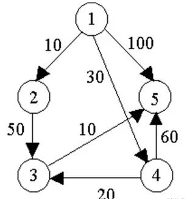
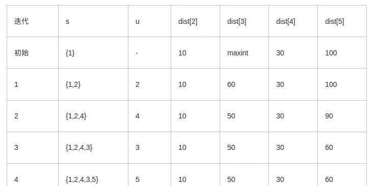

# 贪心算法详解

> 原文链接：https://mp.weixin.qq.com/s?__biz=MzU1NjEwMTY0Mw==&mid=2247584917&idx=1&sn=1195bfb306c44ddf22d3f32f67847896&chksm=fbc9f5f1ccbe7ce76a791908d51b373ebffc40724b2235fc18a28d8233a7f51bbd90d6030f7f&scene=27

顾名思义，贪心算法总是作出在当前看来最好的选择。也就是说贪心算法并不从整体最优考虑，它所作出的选择只是在某种意义上的局部最优选择。

当然，希望贪心算法得到的最终结果也是整体最优的。虽然贪心算法不能对所有问题都得到整体最优解，但对许多问题它能产生整体最优解。如单源最短路经问题，最小生成树问题等。

在一些情况下，即使贪心算法不能得到整体最优解，其最终结果却是最优解的很好近似。

**基本思路：**

1.建立数学模型来描述问题。

2.把求解的问题分成若干个子问题。

3.对每一子问题求解，得到子问题的局部最优解。

4.把子问题的解局部最优解合成原来解问题的一个解。

**实现该算法的过程：**

1.从问题的某一初始解出发;

2.while 能朝给定总目标前进一步 do

3.求出可行解的一个解元素;

4.由所有解元素组合成问题的一个可行解。从问题的某一初始解出发

**0-1背包问题**

有一个背包，最多能承载150斤的重量，现在有7个物品，重量分别为[35, 30, 60, 50, 40, 10, 25]，它们的价值分别为[10, 40, 30, 50, 35, 40, 30]，应该如何选择才能使得我们的背包背走最多价值的物品？

把物品一个个的往包里装，要求装入包中的物品总价值最大，要让总价值最大，就可以想到怎么放一个个的物品才能让总的价值最大，因此可以想到如下三种选择物品的方法，即可能的局部最优解：

①：每次都选择价值最高的往包里放。

②：每次都选择重量最小的往包里放。

③：每次都选择单位重量价值最高的往包里放。

①：选择价值最高的，按照制订的规则（价值）进行计算，顺序是：4 2 6 5 。

最终的总重量是：130。

最终的总价值是：165。

②：选择重量最小的，按照制订的规则（重量）进行计算，顺序是：6 7 2 1 5 。

最终的总重量是：140。

最终的总价值是：155。

可以看到，重量优先是没有价值优先的策略更好。

③:选择单位密度价值最大的，按照制订的规则（单位密度）进行计算，顺序是：6 2 7 4 1。

最终的总重量是：150。

最终的总价值是：170。

可以看到，单位密度这个策略比之前的价值策略和重量策略都要好。

**单源最大路径问题**

给定带权有向图G =(V,E)，其中每条边的权是非负实数。另外，还给定V中的一个顶点，称为源。现在要计算从源到所有其它各顶点的最短路长度。

这里路的长度是指路上各边权之和。这个问题通常称为单源最短路径问题。

Dijkstra算法是解单源最短路径问题的贪心算法。

其基本思想是，设置顶点集合S并不断地作贪心选择来扩充这个集合。

一个顶点属于集合S当且仅当从源到该顶点的最短路径长度已知。

初始时，S中仅含有源。设u是G的某一个顶点，把从源到u且中间只经过S中顶点的路称为从源到u的特殊路径，并用数组dist记录当前每个顶点所对应的最短特殊路径长度。

Dijkstra算法每次从V-S中取出具有最短特殊路长度的顶点u，将u添加到S中，同时对数组dist作必要的修改。

一旦S包含了所有V中顶点，dist就记录了从源到所有其它顶点之间的最短路径长度。

例如，对下图中的有向图，应用Dijkstra算法计算从源顶点1到其它顶点间最短路径的过程列在下表中。



Dijkstra算法的迭代过程：



**2、算法的正确性和计算复杂性**

(1)贪心选择性质

(2)最优子结构性质

(3)计算复杂性

对于具有n个顶点和e条边的带权有向图，如果用带权邻接矩阵表示这个图，那么Dijkstra算法的主循环体需要O(n)时间。

这个循环需要执行n-1次，所以完成循环需要O(n)时间。算法的其余部分所需要时间不超过O(n^2)。

代码实现(来自于第四个参考链接)：

```
#include <iostream>#include <vector>#include <limits>using namespace std ;  
class BBShortestDijkstra{public:    BBShortestDijkstra (const vector<vector<int> >& vnGraph)         :m_cnMaxInt (numeric_limits<int>::max())     {        m_vnGraph = vnGraph ;        m_stCount = vnGraph.size () ;        m_vnDist.resize (m_stCount) ;        for (size_t i = 0; i < m_stCount; ++ i) {            m_vnDist[i].resize (m_stCount) ;        }    }        void doDijkatra (){        int nMinIndex = 0 ;        int nMinValue = m_cnMaxInt ;        vector<bool> vbFlag (m_stCount, false) ;        for (size_t i = 0; i < m_stCount; ++ i) {            m_vnDist[0][i] = m_vnGraph[0][i] ;            if (nMinValue > m_vnGraph[0][i]) {                nMinValue = m_vnGraph[0][i] ;                nMinIndex = i ;            }        }  
        vbFlag[0] = true ;        size_t k = 1 ;        while (k < m_stCount) {            vbFlag[nMinIndex] = true ;            for (size_t j = 0; j < m_stCount ; ++ j) {                // 没有被选择                if (!vbFlag[j] && m_vnGraph[nMinIndex][j] != m_cnMaxInt ) {                    if (m_vnGraph[nMinIndex][j] + nMinValue                        < m_vnDist[k-1][j]) {                        m_vnDist[k][j] = m_vnGraph[nMinIndex][j] + nMinValue ;                    }                    else {                        m_vnDist[k][j] = m_vnDist[k-1][j] ;                    }                }                else {                    m_vnDist[k][j] = m_vnDist[k-1][j] ;                }            }            nMinValue = m_cnMaxInt ;            for (size_t j = 0; j < m_stCount; ++ j) {                if (!vbFlag[j] && (nMinValue > m_vnDist[k][j])) {                    nMinValue = m_vnDist[k][j] ;                    nMinIndex = j ;                }            }            ++ k ;        }  
        for (int i = 0; i < m_stCount; ++ i) {            for (int j = 0; j < m_stCount; ++ j) {                if (m_vnDist[i][j] == m_cnMaxInt) {                    cout << "maxint " ;                }                else {                    cout << m_vnDist[i][j] << " " ;                }            }            cout << endl ;        }    }private:      vector<vector<int> >    m_vnGraph ;    vector<vector<int> >    m_vnDist ;    size_t m_stCount ;    const int m_cnMaxInt ;} ;  
int main(){    const int cnCount = 5 ;    vector<vector<int> > vnGraph (cnCount) ;    for (int i = 0; i < cnCount; ++ i) {        vnGraph[i].resize (cnCount, numeric_limits<int>::max()) ;    }    vnGraph[0][1] = 10 ;    vnGraph[0][3] = 30 ;    vnGraph[0][4] = 100 ;    vnGraph[1][2] = 50 ;    vnGraph[2][4] = 10 ;    vnGraph[3][2] = 20 ;    vnGraph[3][4] = 60 ;  
    BBShortestDijkstra bbs (vnGraph) ;    bbs.doDijkatra () ;}
```

**找零钱问题**

假设你开了间小店，不能电子支付，钱柜里的货币只有 25 分、10 分、5 分和 1 分四种硬币，如果你是售货员且要找给客户 41 分钱的硬币，如何安排才能找给客人的钱既正确且硬币的个数又最少？

这里需要明确的几个点：

```
1.货币只有 25 分、10 分、5 分和 1 分四种硬币；2.找给客户 41 分钱的硬币；3.硬币最少化
```

这个步骤可以分解为：

```
1.找给顾客sum_money=41分钱，可选择的是25 分、10 分、5 分和 1 分四种硬币。能找25分的，不找10分的原则，初次先找给顾客25分；2.还差顾客sum_money=41-25=16。然后从25 分、10 分、5 分和 1 分四种硬币选取局部最优的给顾客，也就是选10分的，此时sum_money=16-10=6。重复迭代过程，还需要sum_money=6-5=1,sum_money=1-1=0。至此，顾客收到零钱，交易结束；3.此时41分，分成了1个25，1个10，1个5，1个1，共四枚硬币。
```

按照上述的方式，我们可以得到一个分硬币的最优解，但是再考虑一下同样的分硬币问题：

还是需要找给顾客41分钱，现在的货币只有 25 分、20分、10 分、5 分和 1 分四种硬币；该怎么办？

按照贪心算法的三个步骤：

```
1.41分，局部最优化原则，先找给顾客25分；2.此时，41-25=16分，还需要找给顾客10分，然后5分，然后1分；3.最终，找给顾客一个25分，一个10分，一个5分，一个1分，共四枚硬币。
```

可以根据这种策略得到一个解，但是该问题是不是最优的解？显然并不是的，因为如果给他2个20分，加一个1分，三枚硬币就可以了。

所以这里就突出了贪心算法的一个问题：不从总体上考虑其它可能情况，每次选取局部最优解，不再进行回溯处理，所以很少情况下得到最优解。

**贪心算法三个核心问题**

第一个问题：为什么不直接求全局最优解?

1、原问题复杂度过高；

2、求全局最优解的数学模型难以建立；

3、求全局最优解的计算量过大；

4、没有太大必要一定要求出全局最优解，“比较优”就可以。

第二个问题：如何把原问题分解成子问题？

1、按串行任务分

时间串行的任务，按子任务来分解，即每一步都是在前一步的基础上再选择当前的最优解。

2、按规模递减分

规模较大的复杂问题，可以借助递归思想（见第2课），分解成一个规模小一点点的问题，循环解决，当最后一步的求解完成后就得到了所谓的“全局最优解”。

3、按并行任务分

这种问题的任务不分先后，可能是并行的，可以分别求解后，再按一定的规则（比如某种配比公式）将其组合后得到最终解。

第三个问题：如何知道贪心算法结果逼近了全局最优值？

这个问题是不能量化判断的，正是因为全局最优值不能够知道，所以才求的局部最优值。追求过程需要考虑以下几个问题:

成本

耗费多少资源，花掉多少编程时间。

速度

计算量是否过大，计算速度能否满足要求。

价值

得到了最优解与次优解是否真的有那么大的差别，还是说差别可以忽略。

版权声明：本文为CSDN博主「一叶执念」的原创文章，遵循CC 4.0 BY-SA版权协议，转载请附上原文出处链接及本声明。

原文链接：

https://blog.csdn.net/YiYeZhiNian/article/details/122211642


↑火爆课程，限时优惠券！🎉速领↑


点击“阅读原文”即可查看课程