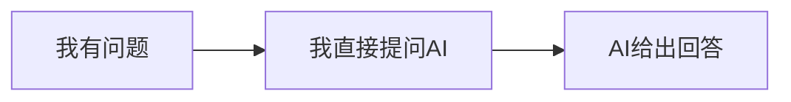

# 高效AI协作方法论：先对齐，再协作
作者：郑大可
发布时间：06/05

## 一、传统AI协作模式的致命缺陷
### 1. 大众通用低效交互流程

复杂研发场景下延伸流程：
1. 直接把完整需求丢给AI，AI一次性输出成品
2. 人工审阅内容，逐处纠错、反复迭代修改
3. 对话上下文越长，修改越混乱，返工量暴增

### 2. 问题根源
双方信息认知错位：**使用者以为AI完全理解需求，AI以为使用者表述清晰**，二者在错误方向持续推进；等到发现产出偏离目标时，沉没成本已经堆积很高。
额外隐患：很多时候使用者自身都没有完全理清整件事的完整逻辑，直接让AI输出，等同于把自己未思考完善的工作全权交由AI兜底。

## 二、优化协作微习惯：先建立全局视野，确认后再开工
### 1. 前置第一步：生成项目指导文档
#### 标准启动提示词模板
```
我要用你帮我完成X（填入具体任务），最终目标是Y（填入最终达成效果）
在正式开工之前，先输出这件事的完整整体路径，梳理任务全程潜在风险问题、核心关键节点，整理一份标准化项目指导MD文档。
我们先针对这份文档逐条补充细节，等我确认无误之后，再正式开始落地执行。
```
#### 项目指导文档必备4大模块
- ✅ 整体执行路径
- ⚠️ 过程潜在问题与风险
- ○ 任务关键时间/步骤节点
- ➡️ 分步骤行动建议

交互逻辑：先和AI对齐全局文档 → 双向补充细节、确认共识 → 确认完成才进入正式内容产出。

### 2. 第二步：多模型交叉验证纠错
1. 将AI生成的项目指导MD文档，分发至多款不同大模型（常用：Claude、ChatGPT、DeepSeek，也可使用AI聚合平台）
2. 统一指令：让模型全面审阅文档，挑剔排查所有会影响最终产出质量的漏洞、逻辑缺陷、缺失项
3. 汇总所有模型反馈，整理**问题清单+配套优化建议**，回头修正原始指导文档

> 补充建议：交叉验证适配绝大多数AI协作场景，通用性极强，推荐所有人使用

## 三、这套「先对齐、再协作」模式带来的改变
1. 大幅减少反复返工、越改越乱的情况：全局指导文档划定方向，AI不会跑偏，阶段性总结保留全部关键细节
2. 协作流程标准化：需求梳理→方案设计→落地实现→测试验收，全程有锚点把控
3. 适用范围不局限复杂工程任务：
    - 开发、写作、策划、设计等项目类工作
    - 知识学习场景：先让AI输出完整学习框架思路，再逐个拆解细分知识点提问学习

## 四、实操落地建议
立刻拿当下正在处理的任意一件事，新建AI对话窗口，套用这套先出全局文档、确认再执行的流程，对比传统提问方式的效率差异。

### 核心理念总结
不存在速成暴富套路，这套方法本质是学会正确驾驭AI工具，放大自身综合做事能力。