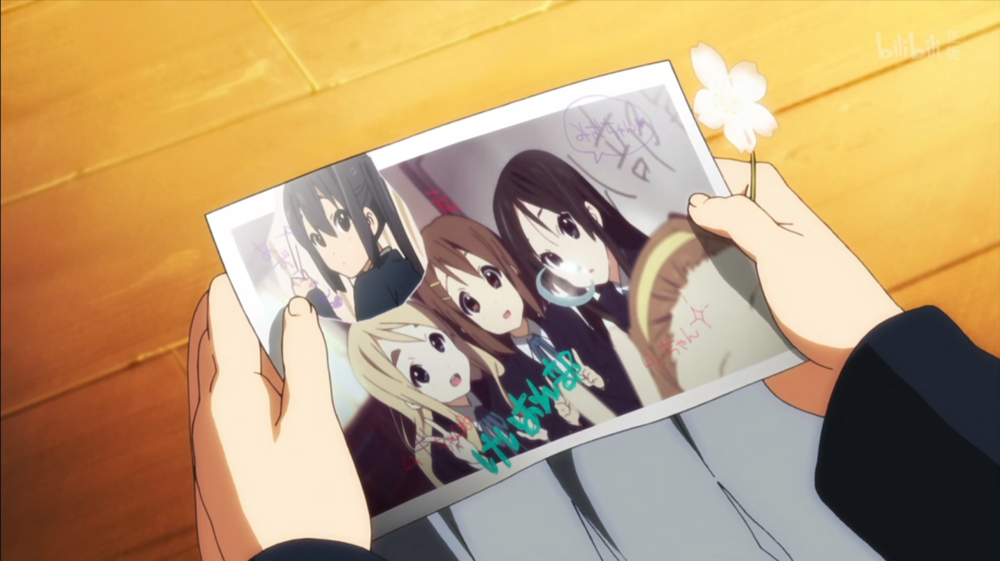
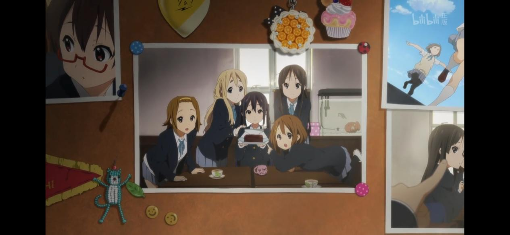

推荐曲目：《相遇天使》

推荐内涵：青春与友情的永恒旋律 ------轻音少女献给青春的离别诗

一、歌曲背景：毕业季的礼物与少女的羁绊

《相遇天使》（《天使にふれたよ!》）是日本动画《轻音少女》系列中最为动人的插曲之一，收录在专辑《放課後ティータイム Ⅱ》（《放学后茶会Ⅱ》）中。这首歌由樱丘高中轻音部的四位学姐------平泽唯、秋山澪、田井中律、琴吹䌷共同创作并演唱，作为毕业前送给学妹中野梓的"离别礼物"。

《相遇天使》的创作并非单纯服务于剧情，而是与角色成长紧密相连。在剧场版中，即将毕业的四人决定前往伦敦进行毕业旅行，而中野梓在得知计划后主动加入，共同经历了一段充满欢笑与回忆的旅程。面对即将到来的离别，学姐们希望通过这首歌表达对梓的感谢与鼓励，同时也将彼此共度的时光凝练成永恒的旋律。四位学姐从构思歌词到完成编曲的过程，展现了她们从"被照顾的学妹"到"成熟的学姐"的身份转变。这种创作行为本身即是对友情的致敬------她们用音乐将无形的羁绊转化为有形的纪念。

虽然这首歌是为中野梓而作，但她在剧中并未参与演奏，反而成为情感传递的纽带，这一设定更凸显了"被赠予者"在友情中的特殊意义。

现实中，这首歌由动画声优丰崎爱生（平泽唯）、日笠阳子（秋山澪）等人演唱，旋律轻柔中带着淡淡的忧伤，钢琴、吉他、贝斯与架子鼓交织的编曲仿佛在诉说着离别的复杂心绪。这种音乐风格与《轻音少女》一贯的治愈基调高度契合，成为粉丝心中"毕业季"的代名词。

二、歌词解析：友情的具象化与青春的诗意

《相遇天使》的歌词以细腻的笔触描绘了少女们共同经历的日常片段,例如歌词中写道："熟悉的校服与拖鞋，还有白板上的涂鸦"，"一起拍的照片,同款的钥匙圈"，这些看似平凡的细节，却是青春最珍贵的"宝物"，这些意象不仅展现了少女们对共同经历的珍视，更将友情升华为一种超越时间的力量。

歌曲的高潮部分的创作颇具特色。歌词创作好后，唯对于最感人的一句歌词"可是啊，我遇见了哦！......"部分始终感觉有点不完美，直到即将演奏之前还在进行最后的努力。她们在活动室外的天台上看到飞鸟在空中划过的痕迹，突然得到灵感。唯提出梓喵给了她们翅膀，是使她们四人变得幸福的小小可爱的天使，将此句定为"可是啊 我遇见了哦！美丽的天使"，同时将曲名也最终定为《相遇天使》。歌词中将中野梓比作"天使"，不仅象征着她在学姐们心中的独特地位，也暗喻了相遇本身即是青春最美的奇迹，就像平泽唯所说的，希望这首歌能成为中野梓的翅膀。

剧中播放"车站月台 河岸小道"、"即使我们日后分离 也要仰望同一天空"几句时还使用了场景再现，起到了很强的催泪效果，甚至能让没听过的人都产生淡淡的感动。当中野梓（昵称梓喵）作为唯一的观众坐在台下时，她的反应成为观众情感的投射口：从最初听到学姐们略显笨拙的演奏时抿嘴偷笑，到被歌词击中后眼眶泛红，再到最后强忍泪水鼓掌说出 "不是很精彩呢！但我还想再继续听下去" ------这句看似傲娇的台词，实则暗含"不愿让离别时刻到来"的潜台词。

三、精神内涵：离别不是终点，而是永恒的起点

《相遇天使》不仅是一首歌，更是一封写给青春的情书，其传递的核心内涵，是"离别中的希望"。它并未沉溺于离别的悲伤，而是通过音乐将离别转化为对未来的期许。歌词中反复出现的"毕业不会是终点，今后也会是伙伴"，以及"我们永远会在一起"，展现了少女们对友情的坚定信念。这种精神与《轻音少女》整体的青春主题一脉相承：青春或许会结束，但音乐与友情塑造的回忆永不褪色。正如剧场版中伦敦塔桥下的合奏场景，即使身处异国，音乐仍能跨越距离，连接彼此的心灵。\

\-\--听众评论\-\--

以呆唯的"不是很精彩呢"开始，以梓喵的"不是很精彩呢"结束，轻音永不毕业

\--丹特丽安

轻音是一部废萌番？我可不这么认为。轻音是我第一部入宅番，它讲述的是美好的校园生活，讲述的是一群女孩去"追逐"音乐的故事。它是一部励志番，也是一部音乐番，就是因为轻音我才会去学吉他，会去想组乐队，去唱歌，尽管我歌唱的不是很好。我喜欢轻音少女，最喜欢了！

\--L

这首《相遇天使》第一次出现在轻音少女第二季24集的后半部分，当时真的是感动的一塌糊涂，高三与高二的离别，想尽办法的想要一起走下去，但不行，所以我理解了那句（毕业不是终点）的含义，《放学后茶会》永不散场。

\--渚拥汐

《相遇天使》为阿梓喵演唱的一首最具有回忆的歌曲，呆唯，澪，侓，䌷与阿梓喵相识，她们之间产生了不可磨灭的友情羁绊，毕业舍不得阿梓喵，为她演唱的《相遇天使》让我感受到了她们之间美好的回忆，令人感动的友情羁绊，丰富多彩的高中青春，她们的日常点点滴滴都是青春的回忆。但是轻音没有终点！！！

\--一行瑠璃
